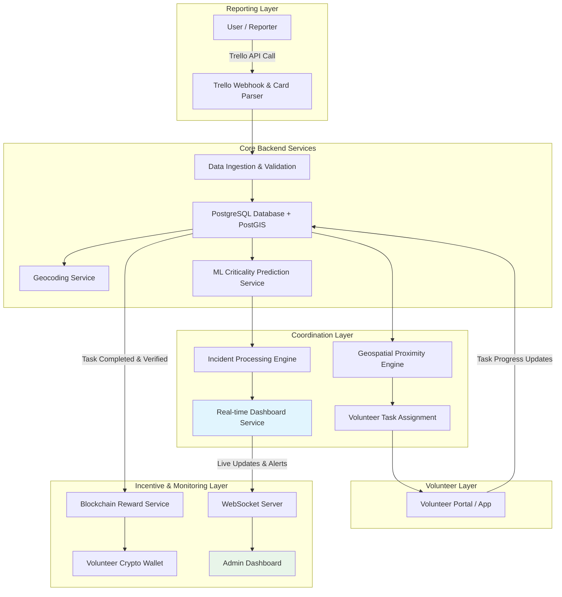

# SmartAccident

**Trello-Integrated Real-Time Accident Reporting, AI-Prioritized Response, and Blockchain-Incentivized Volunteer Coordination Platform**

---

## Overview

SmartAccident is a full-stack, real-time emergency management system designed to accelerate the reporting, assessment, and coordinated response to highway accidents and other user-reported incidents.

The platform uses **Trello API** as the exclusive channel for incident reporting, ensuring structured, automated, and auditable workflows. It intelligently integrates **Machine Learning** for accident criticality assessment, **geospatial intelligence** for rapid volunteer dispatch, a **real-time administrative dashboard** for monitoring, and **blockchain-based incentives** to motivate community volunteers.

**Core Objectives:**
- Significantly reduce emergency response time through automation and intelligent assignment.
- Enable data-driven decision making with AI-powered severity prediction.
- Provide complete transparency and accountability to administrators.
- Build a sustainable volunteer network through transparent cryptocurrency rewards.

---

## Key Features

- **Trello-Driven Incident Reporting**: Fully automated ingestion and processing of accident reports via Trello API calls.
- **AI Criticality Assessment**: Machine Learning model classifies incidents in real-time as *Moderate* or *Highly Critical*.
- **Geospatial Visualization**: Automatic geocoding and interactive map display of accident locations (e.g., “Civil Lines, Nagpur”).
- **Real-Time Administrative Dashboard**: Live monitoring with criticality level, required assistance, task status, and automated inactivity alerts.
- **Proximity-Based Volunteer Assignment**: Tasks are automatically assigned to the nearest available volunteer using live geolocation.
- **Administrative Oversight & Escalation**: Real-time progress tracking with alerts and manual reassignment capability.
- **Blockchain Reward System**: Volunteers register a crypto wallet address and receive automatic rewards upon verified task completion.

---

## System Workflow

1. User reports an accident using a structured Trello API call.
2. System parses the Trello card, validates data, stores details in the database, and geocodes the reported location.
3. Machine Learning model processes the incident and predicts its criticality level.
4. Incident details, including map location and required assistance types, are updated on the administrative dashboard.
5. Geospatial engine identifies and assigns the task to the nearest available volunteer (with location services enabled).
6. Volunteer receives notification, accepts the task, and updates progress in real-time through the platform.
7. Dashboard continuously monitors activity and triggers automated alerts if no progress is detected.
8. Administrator can view full status and manually reassign tasks if required.
9. Upon successful task verification and completion, the system triggers a cryptocurrency reward transfer to the volunteer’s registered wallet address.

---

## System Architecture

The architecture follows a **modular, scalable design** with clear separation of concerns, enabling high performance, maintainability, and future extensibility.

## Major Components:

Frontend Layer: Responsive web interfaces for Admin Dashboard and Volunteer Portal.
Backend Layer: RESTful APIs with real-time WebSocket support.
Data Layer: Geospatial-enabled relational database.
AI Layer: Dedicated ML inference service for criticality prediction.
Integration Layer: Trello API, Mapping APIs.
Blockchain Layer: Smart contracts for secure reward distribution.

## Data Flow

Ingress → Trello API/Webhook → Parser → Validation → Database Storage
Processing → Geocoding → ML Inference → Severity Classification + Assistance Tags
Dispatch → Query nearby volunteers by live location → Automatic Task Assignment + Notification
Monitoring → WebSocket real-time updates → Dashboard Refresh + Inactivity Alert Engine
Completion → Task Status Update → Admin/System Verification → Trigger Smart Contract → Crypto Reward Transfer

All operations involving location data and wallet addresses adhere to strict security and privacy standards.

## Repository Structure

smartaccident/
├── frontend/                    # React.js / Next.js (Admin + Volunteer UI)
├── backend/                     # Main API Server
│   ├── src/
│   │   ├── config/              # Configuration & environment
│   │   ├── controllers/         # Request handlers
│   │   ├── routes/              # API routes
│   │   ├── services/            # Business logic (Trello, ML, Geospatial, Blockchain)
│   │   ├── models/              # Database schemas & ORM models
│   │   ├── middleware/          # Authentication, validation, error handling
│   │   └── utils/               # Helper functions
│   └── ...
├── ml-model/                    # Python-based ML model for criticality prediction
├── blockchain/                  # Solidity smart contracts & reward scripts
├── docs/                        # Additional documentation
├── scripts/                     # Deployment & maintenance scripts
├── docker-compose.yml
├── .env.example
├── Dockerfile
└── README.md

## Technology Stack
## Technology Stack

| Layer                        | Technology                                              | Rationale |
|------------------------------|---------------------------------------------------------|-----------|
| **Frontend**                 | Next.js 15+ (App Router) + React + TypeScript + Tailwind CSS | Modern, high-performance React framework with excellent SSR/SSG support, type safety, and rapid UI development for a responsive admin dashboard and volunteer portal |
| **Backend**                  | Python + FastAPI                                        | High-performance, asynchronous framework with automatic OpenAPI documentation, ideal for seamless integration with ML models and external services |
| **Database**                 | PostgreSQL + PostGIS                                    | Robust, production-ready relational database with powerful built-in geospatial querying capabilities for proximity-based volunteer matching and location storage |
| **Real-time Communication**  | FastAPI WebSockets + Socket.IO (optional Redis adapter) | Enables live dashboard updates, instant volunteer notifications, and automated progress/inactivity alerts |
| **Mapping & Geolocation**    | Leaflet.js + react-leaflet + Google Maps Geocoding API  | Lightweight, free, and reliable solution for interactive maps, accident pin visualization, and accurate address-to-coordinate conversion |
| **Machine Learning**         | Python + Scikit-learn / TensorFlow / PyTorch            | Flexible and efficient ecosystem for building and serving the accident criticality prediction model (moderate vs highly critical) |
| **Blockchain Integration**   | Polygon (or Ethereum) + Web3.py                         | Low-cost, fast, and transparent cryptocurrency reward distribution to volunteers' wallets |
| **External Integration**     | Official Trello REST API + Webhooks                     | Structured, auditable, and reliable mechanism for all accident reporting |
| **Authentication & Authorization** | JWT + Role-Based Access Control (RBAC)             | Secure separation of Admin and Volunteer roles with token-based authentication |
| **Containerization**         | Docker + Docker Compose                                 | Ensures consistent development, testing, and deployment environments across services |
