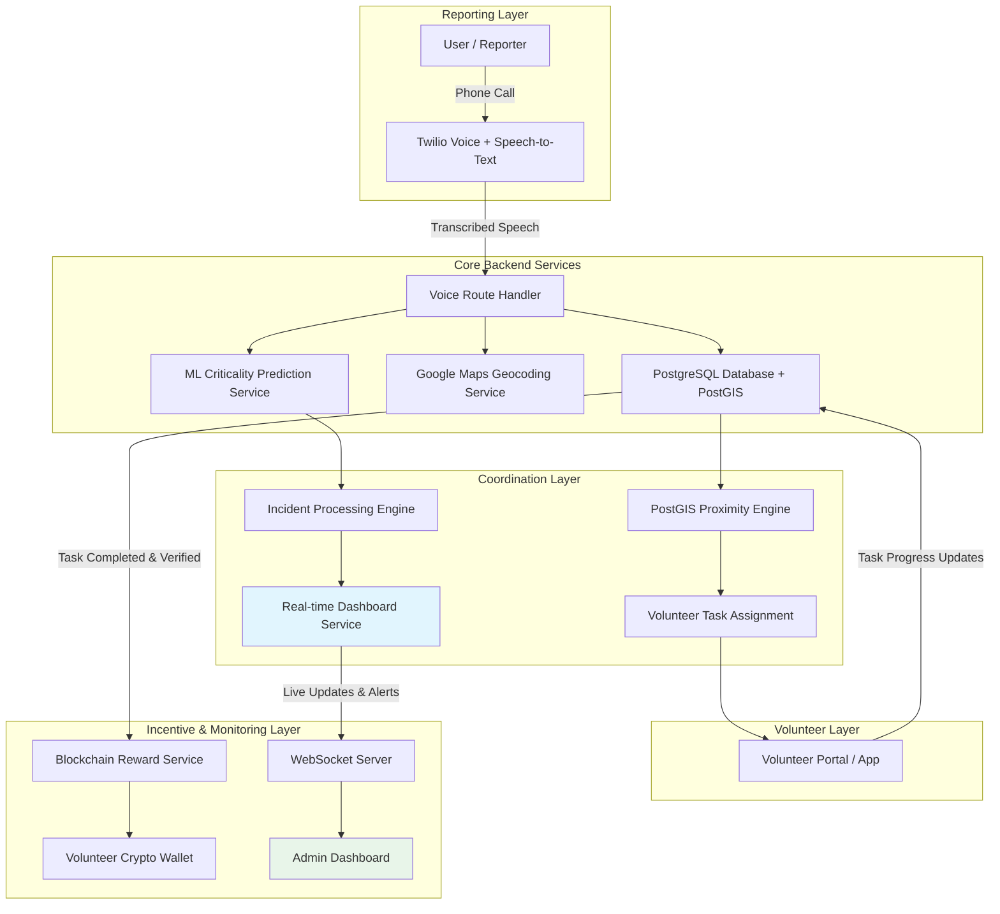

# SmartAccident

**Voice-Powered Real-Time Accident Reporting, AI-Prioritized Response, and Blockchain-Incentivized Volunteer Coordination Platform**

---

## Overview

SmartAccident is a full-stack, real-time emergency management system designed to accelerate the reporting, assessment, and coordinated response to highway accidents and other user-reported incidents.

The platform uses **Twilio Voice Calls** as the primary channel for incident reporting — users simply call a phone number, describe the accident in natural speech, and the system handles the rest. It intelligently integrates **Machine Learning** for accident criticality assessment, **geospatial intelligence** for rapid volunteer dispatch, a **real-time administrative dashboard** for monitoring, and **blockchain-based incentives** to motivate community volunteers.

**Core Objectives:**
- Significantly reduce emergency response time through automation and intelligent assignment.
- Enable data-driven decision making with AI-powered severity prediction.
- Provide complete transparency and accountability to administrators.
- Build a sustainable volunteer network through transparent cryptocurrency rewards.

---

## Key Features

- **Voice-Based Incident Reporting**: Users call a phone number and describe the accident in natural speech. Twilio transcribes the speech and the system processes it automatically.
- **AI Criticality Assessment**: Machine Learning model (TF-IDF + GradientBoosting) classifies incidents in real-time as *Moderate* or *Highly Critical* with confidence scores.
- **Geospatial Visualization**: Automatic geocoding and interactive map display of accident locations.
- **Real-Time Administrative Dashboard**: Live monitoring with criticality level, required assistance, task status, and automated inactivity alerts.
- **Proximity-Based Volunteer Assignment**: Tasks are automatically assigned to the nearest available volunteer using PostGIS geospatial queries.
- **Administrative Oversight & Escalation**: Real-time progress tracking with alerts and manual reassignment capability.
- **Blockchain Reward System**: Volunteers register a crypto wallet address and receive automatic rewards upon verified task completion.

---

## System Workflow

1. **User calls the Twilio phone number** to report an accident.
2. System greets the caller and asks for the **accident location** via speech.
3. Twilio transcribes the speech → system asks for **accident details**.
4. Caller describes the accident (injuries, fire, vehicles involved, etc.).
5. System **geocodes** the location, runs **ML criticality prediction**, auto-extracts **assistance types** from speech.
6. Incident is stored in the database with full details.
7. **Geospatial engine** identifies and assigns the task to the **nearest available volunteer**.
8. System **speaks back confirmation** to the caller: criticality, reference number, and dispatch status.
9. Dashboard continuously monitors activity and triggers automated alerts if no progress is detected.
10. Upon successful task verification, the system triggers a **cryptocurrency reward transfer** to the volunteer's wallet.

---

## System Architecture



## Major Components

| Component | Description |
|---|---|
| **Voice Ingestion** | Twilio voice calls with speech-to-text transcription |
| **Backend API** | FastAPI (async) with RESTful endpoints + Twilio TwiML responses |
| **Database** | PostgreSQL + PostGIS for geospatial-enabled storage |
| **ML Engine** | TF-IDF + GradientBoosting classifier for criticality prediction |
| **Dispatch** | PostGIS `ST_Distance` based proximity matching |
| **Frontend** | Next.js admin dashboard + volunteer portal (planned) |
| **Blockchain** | Polygon smart contracts for reward distribution (planned) |

## Data Flow

```
Ingress → Phone call → Twilio Speech-to-Text → Voice Route Handler
Processing → Geocoding → ML Inference → Severity Classification + Assistance Extraction
Dispatch → PostGIS nearest volunteer query → Automatic Task Assignment + Notification
Monitoring → WebSocket real-time updates → Dashboard Refresh + Inactivity Alert Engine
Completion → Task Status Update → Verification → Smart Contract → Crypto Reward Transfer
```

All operations involving location data and wallet addresses adhere to strict security and privacy standards.

## Repository Structure

```
smartaccident/
├── backend/                     # FastAPI Backend Server
│   ├── src/
│   │   ├── config/              # Settings & database configuration
│   │   ├── models/              # SQLAlchemy ORM models (Accident, Volunteer, Task)
│   │   ├── schemas/             # Pydantic request/response schemas
│   │   ├── routes/              # API routes (accidents, volunteers, tasks, voice)
│   │   ├── services/            # Business logic (Twilio, ML, Geocoding, Dispatch)
│   │   └── utils/               # Geometry conversion helpers
│   ├── alembic/                 # Database migrations
│   └── venv/                    # Python virtual environment
├── ml-model/                    # ML model training & artifacts
│   ├── train.py                 # Training script (TF-IDF + GradientBoosting)
│   ├── training_data.csv        # Synthetic training dataset (600 samples)
│   └── model_metadata.json      # Model performance metadata
├── frontend/                    # Next.js (Admin + Volunteer UI) — planned
├── blockchain/                  # Solidity smart contracts — planned
├── docker-compose.yml           # PostgreSQL + PostGIS container
├── .env                         # Environment variables (gitignored)
└── README.md
```

## API Endpoints

| Method | Endpoint | Description |
|---|---|---|
| `GET` | `/health` | Health check |
| **Voice (Twilio)** | | |
| `POST` | `/api/v1/voice/incoming` | Handle incoming call — greet, ask for location |
| `POST` | `/api/v1/voice/location` | Process transcribed location, ask for details |
| `POST` | `/api/v1/voice/report` | Full pipeline: geocode → ML → store → dispatch → confirm |
| `POST` | `/api/v1/voice/status` | Twilio call status callback |
| **Accidents** | | |
| `GET` | `/api/v1/accidents/` | List all accidents (paginated) |
| `POST` | `/api/v1/accidents/` | Create accident manually |
| `GET/PATCH/DELETE` | `/api/v1/accidents/{id}` | Get / Update / Delete accident |
| **Volunteers** | | |
| `GET` | `/api/v1/volunteers/` | List all volunteers |
| `POST` | `/api/v1/volunteers/` | Register a volunteer |
| `GET/PATCH/DELETE` | `/api/v1/volunteers/{id}` | Get / Update / Delete volunteer |
| **Tasks** | | |
| `GET` | `/api/v1/tasks/` | List all dispatch tasks |
| `POST` | `/api/v1/tasks/` | Create task manually |
| `GET/PATCH/DELETE` | `/api/v1/tasks/{id}` | Get / Update / Delete task |

## Technology Stack

| Layer | Technology | Rationale |
|---|---|---|
| **Voice & Telephony** | Twilio Voice API + Speech-to-Text | Enables natural-language accident reporting via phone calls with automatic speech transcription |
| **Backend** | Python + FastAPI | High-performance async framework with automatic OpenAPI docs, ideal for ML integration |
| **Database** | PostgreSQL + PostGIS | Robust relational DB with built-in geospatial querying for proximity-based volunteer matching |
| **ML Model** | Scikit-learn (TF-IDF + GradientBoosting) | 99.6% F1-score classifier for accident criticality prediction |
| **Geocoding** | Google Maps Geocoding API | Accurate address-to-coordinate conversion for geospatial dispatch |
| **Real-time** | FastAPI WebSockets | Live dashboard updates and instant volunteer notifications |
| **Frontend** | Next.js 15+ (App Router) + React + TypeScript | Modern SSR/SSG framework for admin dashboard and volunteer portal |
| **Mapping** | Leaflet.js + react-leaflet | Lightweight interactive maps for accident visualization |
| **Blockchain** | Polygon + Web3.py | Low-cost, fast cryptocurrency reward distribution |
| **Auth** | JWT + RBAC | Secure role-based access control for Admin and Volunteer roles |
| **Infrastructure** | Docker + Docker Compose | Consistent development and deployment environments |

---

## Quick Start

### Prerequisites
- Python 3.12+
- Docker & Docker Compose
- Twilio account (for voice calls)

### Setup

```bash
# 1. Clone the repo
git clone https://github.com/Auxilus08/HackByte4.0.git
cd HackByte4.0

# 2. Start the database
docker compose up db -d

# 3. Setup backend
cd backend
python3 -m venv venv
source venv/bin/activate
pip install -r requirements.txt  # or install manually

# 4. Configure environment
cp ../.env.example ../.env
# Edit .env with your Twilio credentials:
#   TWILIO_ACCOUNT_SID=ACxxxxxxxxx
#   TWILIO_AUTH_TOKEN=your_token
#   TWILIO_PHONE_NUMBER=+1234567890

# 5. Run migrations
alembic upgrade head

# 6. Train ML model
cd .. && python ml-model/train.py

# 7. Start the server
cd backend && uvicorn src.main:app --host 0.0.0.0 --port 8000 --reload
```

### Testing Voice Calls Locally

```bash
# Simulate what Twilio sends (no Twilio account needed):

# Step 1: Incoming call
curl -X POST http://localhost:8000/api/v1/voice/incoming \
  -d "From=+919876543210"

# Step 2: Location spoken
curl -X POST http://localhost:8000/api/v1/voice/location \
  -d "SpeechResult=NH44+near+Nagpur&Confidence=0.9"

# Step 3: Full report (triggers pipeline)
curl -X POST "http://localhost:8000/api/v1/voice/report?location=NH44+near+Nagpur" \
  -d "SpeechResult=Truck+overturned+5+people+trapped+fire&Confidence=0.9&From=+919876543210"
```

### Real Phone Calls (with Twilio)

1. Get a Twilio phone number
2. Expose your server: `ngrok http 8000`
3. Set Twilio webhook URL to: `https://your-ngrok.ngrok.io/api/v1/voice/incoming`
4. Call your Twilio number — the full pipeline runs automatically!
